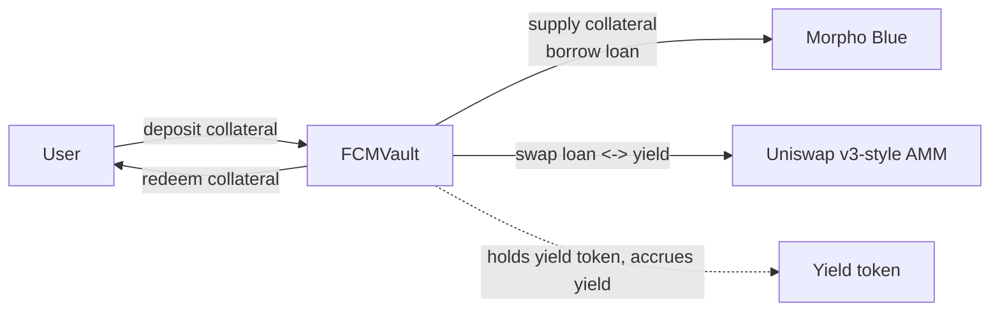

# FCM core

FCM is an automated carry trade protocol: vaults are deployed which automatically borrow against deposited collateral to invest in a yield-bearing asset.
This allows earning a higher yield on assets which typically do not have access to high yield sources, such as BTC.

FCM continuously `rebalance`s the position to hold as high an LTV as safely possible, maximizing exposure to the yield-bearing asset while staying clear of liquidation, and periodically `harvest`s the accrued yield back into collateral to keep 100% asset exposure.

## Architecture

Each `FCMVault` is an ERC-4626 vault that runs a single, immutable three-leg carry trade:

1. **Collateral leg** — the ERC-4626 asset, supplied to [Morpho Blue](https://github.com/morpho-org/morpho-blue) to create borrowing capacity.
2. **Debt leg** — a loan token borrowed against that collateral.
3. **Yield leg** — the loan token swapped into a yield-bearing token (the carry source) on a Uniswap-v3-style AMM.



A deposit posts collateral, borrows against it, and swaps the proceeds into the yield token, all in one transaction; a redeem reverses this, selling the yield leg, repaying debt, and returning collateral, also in one transaction.

A permissionless `rebalance()` keeps LTV inside a target band — delevering (selling yield for loan token, repaying debt) when the collateral price falls and levering back up when it rises — so the vault never sells collateral to manage risk.
A permissionless `harvest()` periodically converts surplus yield back into collateral, so depositors keep full collateral exposure while compounding the yield spread directly into share price. Both entry points are permissionless by design.

## Using the vault

Use the **slippage-protected overloads**, not the bare ERC-4626 signatures:

```solidity
vault.deposit(assets, receiver, minSharesOut);
vault.redeem(shares, receiver, owner, minAssetsOut);
```

Both wrap the standard function and revert `SlippageExceeded` if the output falls short. `deposit(assets, receiver)` and `redeem(shares, receiver, owner)` take no slippage argument (per the ERC-4626 spec) and swap at whatever price the pool gives, so calling them directly is only safe behind a router that enforces its own minimum-output check.

Note that several ERC-4626 functions are intentionally unimplemented — `mint`, `withdraw`, and all four `preview*` functions revert `NotImplemented()`. See [Architecture](./docs/architecture.md#deposit-and-redeem-logic).

Access is gated by an owner-managed allowlist (`earlyAccess`) on the share receiver, and by `maxTvl`. Both default to "closed" on a fresh deployment.

## Documentation

| Doc                                                 | Answers                                         |
| --------------------------------------------------- | ----------------------------------------------- |
| [`architecture.md`](./docs/architecture.md)         | How does it work, and why is it built this way? |
| [`security.md`](./docs/security.md)                 | What can an adversary do, and what bounds it?   |
| [`security-surface.md`](./docs/security-surface.md) | What still works when a dependency goes down?   |
| [`risk-disclosures.md`](./docs/risk-disclosures.md) | What does it cost when nothing goes wrong?      |
| [`operations.md`](./docs/operations.md)             | What must the owner and keepers actually do?    |

### Start here

- **Depositors** — [Risk Disclosures](./docs/risk-disclosures.md), then [Owner trust](./docs/security.md#owner-trust). FCM runs a levered position; the costs and risks of constantly borrowing, repaying, and swapping are inherent to the strategy, not implementation defects.
- **Reviewers** — [Architecture](./docs/architecture.md), then [Security](./docs/security.md).
- **Deployers** — [Operations](./docs/operations.md). A vault is inert until configured, and several defaults are footguns if left alone.

### Two things worth knowing up front

**The factory is permissionless.** `FCMVaultFactory` deploys vaults with arbitrary tokens, pools, oracles, and owner. **A vault existing does not make it safe.** See [what the constructor does and does not validate](./docs/security.md#deployment-trust-model-and-constructor-validation).

**The owner can sweep the vault.** After a 7-day timelock, `executeEmergencyRecovery()` transfers the entire position to the owner and permanently disables redemptions. The timelock window is holders' only protection and their only exit. See [Owner trust](./docs/security.md#owner-trust).

## Development

```sh
forge build
forge test                          # unit tests; fork tests excluded by default
FOUNDRY_PROFILE=ci forge test       # everything, including the Flow mainnet fork tests
make ci                             # fmt + lint + gas snapshot + build + test
```

Fork tests are excluded from the default profile via `no_match_path` in `foundry.toml`; the `ci` profile clears it.
