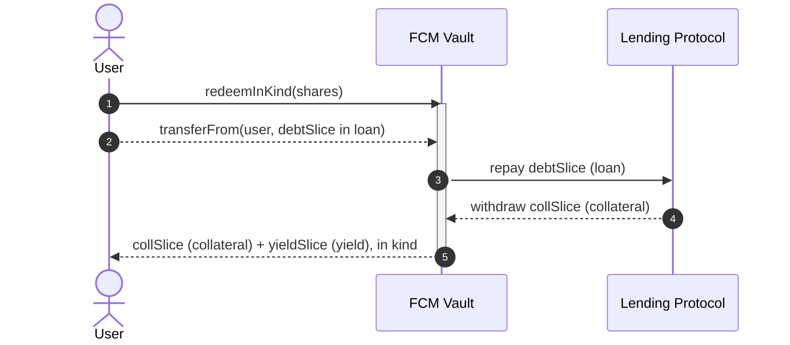
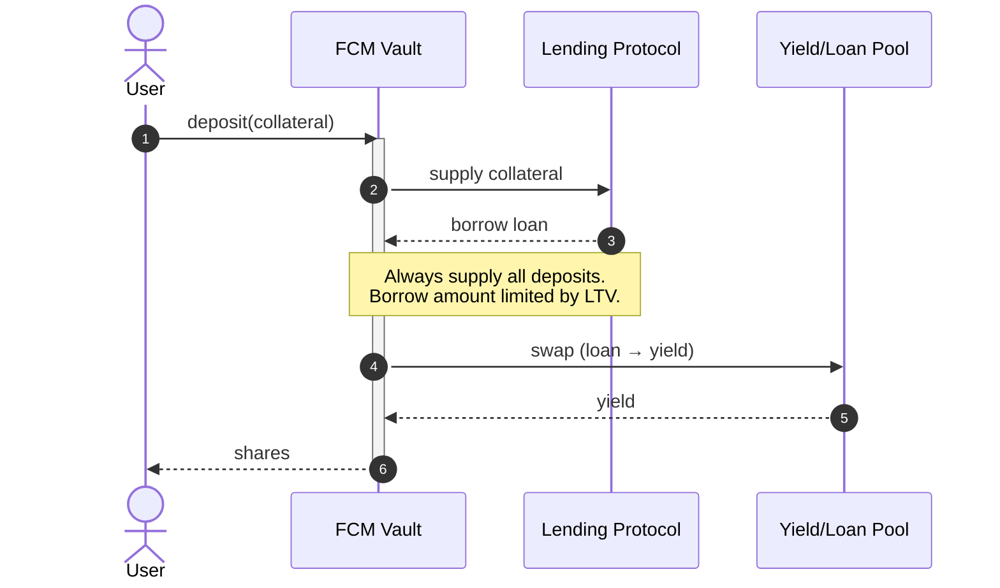
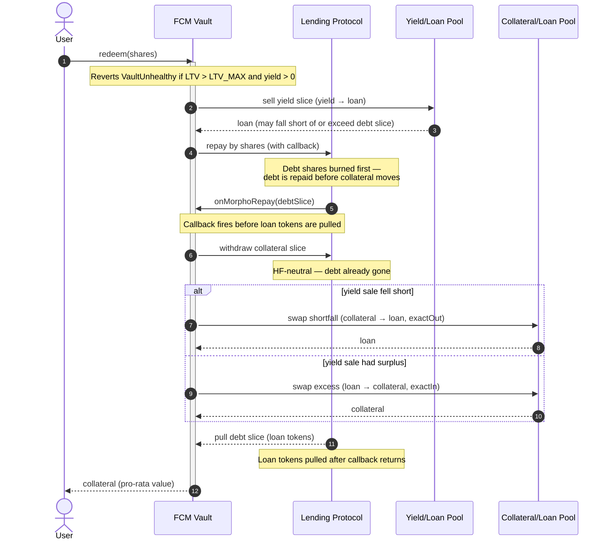

# FCM Architecture

This doc explains how `FCMVault` implements the automated carry trade and the tradeoffs behind each of those.
It assumes familiarity with [Morpho Blue](https://github.com/morpho-org/morpho-blue) (health factor, LLTV, market params) and Uniswap v3 (price limits, price impact).

## Terminology

- **Collateral** - The token the user deposits and the vault posts to the lending protocol to create borrowing capacity. It is the vault's ERC4626 asset.
- **Loan** - The debt token borrowed against the collateral.
- **Yield** - The yield-bearing token bought with the borrowed debt. The carry source.

## Design choices

### Deposit and redeem logic

There are two ways to structure entry and exit for a carry-trade vault:

|                              | Lazy (typical ERC4626)                              | Atomic (chosen)                                           |
| ---------------------------- | --------------------------------------------------- | --------------------------------------------------------- |
| Capital allocation           | Deferred to the next `rebalance()`                  | Happens inside `deposit`/`redeem`                         |
| Entry/exit cost              | Socialized across all holders via later rebalances  | Borne entirely by the depositing/redeeming party          |
| ERC4626 compliance           | Full — `preview`/`max` are trivial                  | Partial — `preview`/`max` depend on live Morpho/AMM state |
| Idle collateral buffer       | Needed to absorb deposits before the next rebalance | Not needed                                                |
| Async redemptions (ERC-7540) | Effectively required at high rebalance frequency    | Not needed                                                |

The lazy approach keeps every ERC4626 function trivial, but defers the cost of levering/unlevering to the next rebalance — and since rebalancing runs at high frequency, that cost would otherwise be socialized across all holders unless additional safeguards were added.

Atomic approach has been chosen instead: `deposit`/`redeem` enter and exit the position immediately, so the depositing or redeeming party covers their own cost and the position's LTV is never left worse off for existing holders.
It also removes the need for an idle collateral buffer and for async redemption requests.
The tradeoff is that these actions now depend on Morpho and the AMM, so several `preview`/`max` functions can no longer be implemented meaningfully.
We accepted this reduced ERC4626 compliance in exchange for a smaller attack surface and no idle-liquidity requirement:

- `mint`, `withdraw`, `previewMint`, `previewWithdraw`, `previewDeposit`, and `previewRedeem` all revert `NotImplemented()`.
- `maxMint` and `maxWithdraw` both return `0`, consistent with `mint`/`withdraw` being unimplemented.
- `maxDeposit` and `maxRedeem` are implemented, but only as optimistic upper bounds — not guarantees.
- `deposit`/`redeem` take no slippage parameter on their standard ERC-4626 signatures, so direct calls are vulnerable to sandwich attacks. Slippage-protected overloads (`deposit(assets, receiver, minSharesOut)` and `redeem(shares, receiver, owner, minAssetsOut)`) are provided.

### Trading the yield leg

Both levering and delevering need to convert between the debt token and the yield token. There are two ways to source that conversion: trade on an AMM, or go direct through the ERC4626 vault's own `deposit()`/`redeem()`. We chose the AMM.

A direct integration would need a bespoke implementation per yield source — each yield vault's deposit/redeem interface, decimals, and settlement semantics differ — and breaks down entirely for any yield source that settles asynchronously (ERC-7540-style request/claim vaults), since the atomic entry/exit design above has no room for a multi-step settlement. Trading on an AMM works against any tradeable token with a pool, with no vault-specific integration at all.

|                  | AMM                                                | Direct                                          |
| ---------------- | -------------------------------------------------- | ----------------------------------------------- |
| Liquidity source | AMM pool depth                                     | Yield vault's own deposit/redemption capacity   |
| Execution price  | Market price, not NAV (may realize above or below) | NAV, exact                                      |
| Cost             | Pays DEX fees/slippage                             | No LP fee, no slippage                          |
| Compatibility    | Any tradeable token, no vault-specific integration | Requires synchronous deposit/redemption support |

The loan and yield tokens form a stable/stable pair — the yield token is priced in, and appreciates slowly relative to, the loan token — so the pool can run at very high liquidity concentration. A pool sized at **~2–3% of protocol TVL** is enough to support the protocol.

### Liquidity source on exit

A redemption sells the yield slice for loan tokens on the yield/loan pool, then repays the pro-rata debt slice. Those proceeds rarely match the debt slice exactly — a thin pool, an adverse tick, a depegged yield token — leaving a gap (surplus or shortfall) that must be reconciled before collateral can be released.

The vault closes this gap with a **flash-repay** via Morpho's `repay` callback. `MORPHO.repay` is called by shares with a non-empty `data` payload. Morpho burns the debt shares first (the accounting repayment), then invokes `onMorphoRepay` _before_ pulling the loan tokens from the caller. That ordering is the whole point: by the time the callback runs, the debt is already repaid, so the collateral withdrawal inside it is health-factor-neutral — Morpho's health check sees zero borrowing power against the freed collateral, not an over-levered position near LLTV.

Inside `onMorphoRepay`, the vault withdraws the collateral slice and reconciles the gap on the collateral/loan pool:

- **Shortfall** (yield sale proceeds < debt slice): sell collateral → loan (`exactOut`) to raise the remaining loan tokens.
- **Surplus** (yield sale proceeds > debt slice): sell the excess loan → collateral (`exactIn`).

After the callback returns, Morpho pulls the full debt slice in loan tokens from the vault. The vault now holds the collateral slice (plus or minus the swap difference) entirely in the collateral token, which `redeem` transfers to the receiver.

`redeem` is gated by a health check: if the vault's LTV exceeds `LTV_MAX` and it holds yield, the call reverts `VaultUnhealthy()`. This is not just a safety guard — it prevents a race for pool liquidity under stress. When the position is unhealthy, the yield slice is worth less than the debt slice (the gap is large), so every redeemer would need to sell collateral on the collateral/loan pool to close that gap. Blocking `redeem` until `rebalance` restores health means redeemers never compete for that pool's liquidity at the worst moment. `redeemInKind` remains available as an exit path regardless of health, since it takes no swap.

### Escape Hatch

A swap-free, in-kind exit, exposed as its own `redeemInKind` function distinct from the standard `redeem` above. The holder repays their pro-rata debt slice in loan tokens, their shares are burned, and they receive the pro-rata collateral and yield tokens in kind.



Because it delivers the yield leg in kind instead of selling it, it needs no swap — so it doesn't depend on the AMM or the yield vault to liquidate that leg (the two routes a normal `redeem` would use), and stays available when AMM liquidity is thin or manipulated.
It still settles through Morpho, so the collateral withdrawal is subject to Morpho's collateral-price check; an underwater position can't be exited until liquidation restores it.
One dependency it does retain: fees accrue on entry and mark NAV via the yield and market oracles — so `redeemInKind` is swap-free but not oracle-free.
The caller must hold and approve the loan-token debt slice (it is not sourced from the position), and the yield leg is returned in kind as yield tokens, to be unwound separately.

### Rebalancing

The position drifts on its own: the collateral price moves, Morpho accrues interest on the debt, and the yield token's price appreciates.
Rebalancing is how the vault is pulled back toward its intended leverage without anyone taking custody of the position.
It is split across two entry points — `rebalance()` adjusts leverage, `harvest(maximumYield)` realizes surplus yield into collateral — deliberately kept separate so the keeper can size the yield sale independently of the leverage decision.

#### The LTV Band

Two immutable constants define the operating band, ordered by the constructor as `ltvMin < ltvMax < marketLltv`:

| Constant  | Role                                                 |
| :-------- | :--------------------------------------------------- |
| `LTV_MAX` | Upper bound — above it the position is over-levered  |
| `LTV_MIN` | Lower bound — below it the position is under-levered |

`rebalance()` reads the current LTV once and takes one of three paths:

- **Inside `[LTV_MIN, LTV_MAX]`** — no-op. The band exists so ordinary price noise does not pay AMM fees. The checks are strict (`debt > maxDebt` / `debt < minDebt`), so landing exactly on either edge is a no-op.
- **Above `LTV_MAX`** — delever: sell yield for loan on the yield/loan pool and repay debt, bringing LTV down to `LTV_MAX`.
- **Below `LTV_MIN`** — lever up: borrow loan, swap it for yield on the yield/loan pool, and repay whatever the swap did not consume, bringing LTV up to `LTV_MIN`.

Both branches rebalance to the edge that was breached, not to a central target. Swap cost is price impact plus the pool's LP fee, and both scale with volume, so the smallest swap that restores the position to the band is the cheapest way to do it. Landing at a midpoint would trade more than necessary on every excursion.

`deposit` is the exception: fresh collateral is levered toward the **midpoint** of the band `(LTV_MIN + LTV_MAX) / 2`, not toward an edge. A deposit is not responding to a breach, so it should leave symmetric headroom in both directions rather than parking the position next to a bound it would immediately trip.

Lever-up is additionally suppressed while an emergency recovery is pending (`emergencyRecoveryActive`): the position is slated for wind-down, so adding debt and paying AMM cost works against it. Delever stays live — it only de-risks. Cancelling the recovery restores lever-up immediately.

#### Why the rebalance swap is stable/stable

The collateral is never sold to rebalance. Only the debt leg moves:

```
delever:  sell yield → loan, repay      x = D − LTV_MAX · V
lever-up: borrow loan → buy yield       x = LTV_MIN · V − D
```

Because the collateral is untouched, `V` — the denominator of `LTV = D / V` — does not move during a rebalance. Two consequences follow, and together they are the main reason the strategy is cheap to run:

- **The swap is stable/stable.** Both sides of the rebalance trade are the loan asset and a yield token denominated in it, so the swap sits in a low-fee, low-volatility pool rather than crossing the volatile collateral pair. Only `harvest` ever touches the collateral/loan pool, and only to _buy_ collateral.
- **The swap is small.** Rebalancing corrects the numerator only, so the trade is the LTV gap times collateral value — not a fraction of the whole position. Backtested over three years of BTC 1-minute history at the deployed band, that is a median swap of **~0.15% of collateral** (p99 ~0.98%, worst ~3.5%), at ~1.3 rebalances/day and ~0.98× annual turnover.

A design that sold collateral to delever would move `V` and `D` at once, cross the volatile pair on every rebalance, and pay both the higher fee tier and materially higher price impact — while also reducing the depositor's collateral exposure, which is the thing they came for.

#### Why the band is where it is

The band width trades two costs against each other, and the operating point is chosen by simulation rather than by hand:

- A **higher upper LTV edge** deploys more borrowed capital into the yield leg, so it captures more carry — but it sits closer to the liquidation line and leaves less room for a price move between rebalances.
- A **wider band** triggers fewer rebalances and so pays less aggregate fee and impact — but spends more time near the edge and makes each individual rebalance larger, and price impact is quadratic in swap size.

The deployed [60%, 70%] band is where the marginal carry from levering tighter stops being worth the marginal swap cost and tail risk. The band checks are strict inequalities, so a rebalance that lands exactly on the edge is a no-op — no separate re-entry targets are needed.

The upper edge is the safety-critical choice. From the most-levered state (70% LTV) the collateral must fall **18.6%** before the position reaches the 86% liquidation line, so the question is how large a drop can land inside one rebalance interval. Measured against BTC 1-minute history, a 3-year lookback never exceeded ~13% in an hour, a 5-year lookback (LUNA/FTX) reaches ~17.6% in 15 minutes, and a 10-year lookback (COVID) reaches ~19.7% **in a single minute**. The deployed band therefore survives a 5-year-class event with thin margin and does not survive a 10-year-class one at any practical cadence. That is a deliberate, quantified stance, not an oversight — and it is the reason the band is a per-vault deploy parameter. See [`risk-disclosures.md` §5](./risk-disclosures.md#5-leverage--liquidation).

Note what that data rules out: **speed is not a substitute for margin.** Past roughly a 5-minute interval the worst observed drop is nearly flat, so rebalancing faster buys almost nothing, and no practical interval escapes a 20%-in-one-minute crash. Only a lower upper edge does.

### Harvest

`harvest` is the compounding leg. It measures how much yield the vault holds above what is needed to back the debt: `yieldToHarvest = yield - debtInYieldAsset`, where `debtInYieldAsset = ceil(debt * 1e36 / yieldPrice)` is the yield-token balance whose oracle value exactly backs the debt. Any surplus is value the vault has earned but not yet captured, so harvest realizes it in two legs: yield → loan on the yield/loan pool, then loan → collateral on the collateral/loan pool, supplying the result as fresh collateral to Morpho.

Harvest is add-only — it never borrows and never withdraws — so it cannot push the position toward liquidation. It raises the LTV's denominator; if that drops LTV below `LTV_MIN`, the next `rebalance()` borrows against the new collateral to restore leverage.

**Why it is a separate entry point.** Harvest originally ran inside `rebalance()`, before the leverage adjustment. Splitting it out buys two things:

- **Failure isolation.** Harvest is the only path that touches the collateral/loan pool, the thinner and more expensive of the two. Inside `rebalance()`, a revert on that leg — an exhausted pool, a `LeftoverLoanTokens` condition — would unwind the delever that had already executed in the same transaction, discarding safety-critical work because a compounding step failed. Delevering must not depend on the harvest pool being healthy.
- **Independent sizing.** `maximumYield` lets the caller spread a large surplus over several calls rather than crossing both pools in one block. That knob only makes sense on a function the keeper can call on its own schedule; forcing it through `rebalance()` would couple the yield-sale size to the leverage cadence, which is set by price volatility and has nothing to do with how much surplus has accrued.

The two legs handle a partial fill differently. Leg 1's unsold surplus simply stays as yield tokens and is retried next harvest. Leg 2 is stricter: if the collateral/loan pool cannot convert all the loan tokens, the call reverts `LeftoverLoanTokens` rather than stranding idle loan tokens (which are invisible to NAV). The caller can retry with a smaller `maximumYield` that fits the pool's depth.

### Partial Fills Instead of Reverts

Every swap in `rebalance` and `harvest` carries a `sqrtPriceLimitX96` derived from the relevant oracle discounted by `maxSlippageBps`. The pool fills only while its marginal price stays inside that bound and then stops. Consequences:

- A rebalance too large to reach the band edge within tolerance **partial-fills** and lands part-way. It does not revert.
- A pool already priced past the bound makes the leg a **no-op**, not a revert.
- The bound is on the pool's marginal price relative to the oracle — i.e. on price impact. The LP fee is a separate, known cost taken on the input and is not part of it.

Choosing partial fill over revert trades a hard failure for a soft, temporary drag that resolves over subsequent calls. The cost is delayed compounding: a partial delever leaves LTV closer to the liquidation threshold for longer than a full one would.

### Why Rebalancing Is Permissionless

`rebalance()` and `harvest(uint256)` are callable by anyone. This is intentional, and it is the case the [Sandwich Attack](#sandwich-attack) section flags as dangerous — so the reasoning is worth stating explicitly rather than leaving implicit.

**Why it has to be.** A levered position must be defended continuously. If rebalancing were gated on a keeper role, a keeper outage would convert a liveness failure into a solvency failure: the position would sit over-levered until the key came back, and Morpho would liquidate on its own schedule in the meantime. Scheduler contention, fee-vault depletion, and Cadence out-of-effort are all real failure modes of the Cadence automation, and they correlate with market stress — exactly when a delever matters most. A permissionless direct call is the backstop that keeps an automation failure from becoming a loss of principal. That backstop only works if it is open to whoever notices first.

**What makes it acceptable.** The danger in the sandwich section is an attacker invoking a swap of _someone else's_ funds on their own schedule. Four properties bound that here:

- **No pricing input from the caller.** `rebalance()` takes no arguments. `harvest`'s only argument, `maximumYield`, is a cap — it can lower how much is sold, never raise it or steer the price.
- **The caller is paid nothing.** There is no keeper fee, rebate, refund, or callback. Fee shares minted during accrual go to `feeRecipient`, never to `msg.sender`, so triggering a rebalance is a pure gas cost to the caller.
- **Every swap is oracle-bounded.** Unlike `deposit`/`redeem` — which swap unbounded, but only ever the caller's own funds — both keeper paths clamp each leg to `maxSlippageBps` of price impact against the oracle. This is the structural reason the bound exists on these two functions and not the others.
- **Neither function can be re-armed at will.** `rebalance` only acts outside the band and leaves the position inside it, so a second call in the same block is a no-op. `harvest` only fires when the vault holds surplus yield (yield balance exceeds debt valued in yield) and drives that surplus to zero. An attacker cannot loop either one; they must wait for the position to drift back out on its own.

**Residual.** This bounds the loss per call, not the number of calls. An attacker who pre-positions a pool to just inside the `maxSlippageBps` bound and then triggers a rebalance captures up to that bound plus the LP fee on the volume traded, and can do so again on each genuine excursion. Aggregate cost over time is therefore unbounded and is a direct consequence of following the market — the same trade-off recorded in [risk-disclosures §1.2](./risk-disclosures.md). The lever governing it is `maxSlippageBps`, which should be set as close to genuine execution cost as liveness allows: too tight and rebalances no-op when they are most needed, too loose and every excursion is a subsidy.

## Deployment Trust Model & Constructor Validation

`FCMVaultFactory.createVault` is permissionless: anyone can deploy an `FCMVault` with any `InitParams`. **Deployment through the canonical factory is not an endorsement.** The factory fixes the bytecode and makes the address deterministic; it says nothing about whether the parameters describe a sane vault. A vault must be judged on its own configuration — tokens, Morpho market, pools, oracles, owner — exactly as any directly deployed contract would be.

The constructor validates what is cheap and locally decidable: the LTV band ordering (`ltvMin < ltvMax < marketLltv`) and non-zero addresses for every external dependency. The `forceApprove` calls incidentally reject a zero or non-contract `collateralToken`, `loanToken`, and `morpho`.

It deliberately stops short of a full correctness check, because a constructor cannot perform one. Whether the yield oracle really prices the yield token in loan tokens, whether the configured pool is the pool the vault will trade through, whether the yield source is solvent — these are properties of external contracts and of live state, not of the arguments. A partial on-chain check would mostly buy false confidence.

The bar we hold instead: **a misconfigured vault must be unusable, never quietly wrong.** A vault that reverts on every deposit is an acceptable outcome of a fat-fingered deployment; one that accepts deposits while silently mispricing them is not. Two structural properties do most of that work:

- **Morpho validates the market tuple for us.** The market id is `keccak256(loanToken, collateralToken, marketOracle, marketIrm, marketLltv)`, and every Morpho entry point requires `market[id].lastUpdate != 0`. Get any one of those five wrong and the derived id points at a market that was never created, so `supplyCollateral`, `borrow`, `repay`, and `withdrawCollateral` all revert. The vault is dead on arrival rather than quietly operating against the wrong market.
- **The swap price bound is oracle-derived, not pool-derived.** `SwapLib.swapLimit` builds `sqrtPriceLimitX96` from the oracle rate discounted by `maxSlippageBps`; the configured pool address is read only for the `slot0` spot check that decides whether to attempt the swap at all. The pool enforces the limit natively. So a mismatched `yieldLoanPool` / `collateralLoanPool` corrupts the go/skip decision — spurious skips leaving rebalance a no-op, or attempts the pool rejects — but it cannot make a swap execute outside the oracle-derived bound.

What is left unvalidated therefore lands in "unusable" rather than "exploitable": a wrong or zero `yieldOracle` reverts the first time `price()` is decoded, a wrong market tuple reverts on the first Morpho call, and a wrong pool degrades rebalancing instead of unbounding it. The residual risk sits with whoever chooses to deposit into a given vault — the same place it sits for any permissionlessly deployed contract.

### Donation/Inflation Attack

See [explanation from OpenZeppelin](https://docs.openzeppelin.com/contracts/5.x/erc4626#security-concern-inflation-attack).

Our implementation is safe from this attack because we inherit from the OpenZeppelin ERC4626 base contract, which implements a virtual share mitigation. See [here](https://github.com/OpenZeppelin/openzeppelin-contracts/blob/master/contracts/token/ERC20/extensions/ERC4626.sol#L22-L47) for guidance on extending this mitigation.

### Re-entrancy Attack

Every externally callable function that moves value or touches an external protocol on a
caller's behalf carries OpenZeppelin's `nonReentrant` modifier: `deposit`, `redeem`,
`redeemInKind`, `rebalance`, `harvest`, and `accrueFees`. Between them these cover every
path that calls out to Morpho, the swap pools, or transfers tokens.

- **`onMorphoRepay` is deliberately _not_ `nonReentrant`.** It is the repay callback
  Morpho invokes synchronously, mid-call, from inside `redeem`'s `_unwindSlice` — by
  the time it runs, the guard is already `ENTERED` from `redeem`'s own modifier, so adding
  `nonReentrant` here would make the callback revert against itself. Instead it is
  authenticated: `require(msg.sender == address(MORPHO))`. That is sufficient because the
  only way `MORPHO.repay` calls back into this function is in response to a repay
  this same vault requested a few frames up the same call stack (`_unwindSlice` → `repay`).
  An attacker cannot reach it directly, and cannot get Morpho to call it except by way of a
  repay the vault itself initiated.
- **Owner-only setters are intentionally not `nonReentrant`.** `setMaxSlippageBps`,
  `setManagementFeeBps`, `setPerformanceFeeBps`, `setFeeRecipient`, `grantEarlyAccess`,
  `revokeEarlyAccess`, `setMaxTvl` are all `onlyOwner`. The fee setters call `_accrueFees()`,
  which calls `MORPHO.accrueInterest` — an external call, but to the immutable, trusted
  Morpho singleton, which has no callback into the vault. Access control, not the guard, is
  the operative defense for this group.
- **`uniswapV3SwapCallback` is authenticated, not `nonReentrant`.** `SwapLib` calls the
  Uniswap v3 pool's `swap` directly, so the vault _is_ the callback target — but the callback
  only pays the pool back via `safeTransfer`, after checking `msg.sender` is one of the two
  immutable pool addresses. No vault state is read or written inside it, so there is no
  reentrancy surface to protect; the `nonReentrant` guard from the calling entry point
  (`deposit`, `redeem`, `rebalance`, `harvest`) is already `ENTERED` by the time the callback
  fires.
- **Realized amounts are read from balance deltas, not trusted return values**, e.g.
  `redeem`'s `assets = COLLATERAL_TOKEN.balanceOf(address(this)) - assetBefore`. This
  isn't primarily a reentrancy mitigation (the guard already prevents a nested call into the
  same entry point) but it does mean pre-existing token dust sitting in the contract can't be
  credited to the wrong caller.
- **The allowlist hook (`_update`) is pure storage.** It runs on every mint/burn/transfer and
  makes no external call, so it adds no reentrancy surface of its own.

### Sandwich Attack

An attacker manipulates AMM prices before and after our swap to capture part of the value of our swap.

- The primary mitigation is a slippage limit, which limits how much slippage we will accept on each trade. This doesn't prevent the attack, but does limit how much value can be extracted per trade.
- `rebalance` enforces this limit using the pool's native `sqrtPriceLimitX96`: each rebalance swap carries a marginal-price bound derived from the yield oracle discounted by `maxSlippageBps`. The pool fills the swap only while its marginal price stays within the bound, then stops. A swap too large to reach the band edge within tolerance is a **partial fill** rather than a revert. Successive rebalances are expected to fill more as the gap (and price impact) shrinks, converging over several calls.
- The bound is on the pool's **marginal price** relative to the oracle, i.e. on price impact. The pool's fixed LP fee is a separate, known cost taken on the input and is not part of this bound.
- Flow as the underlying platform provides some protection. There is no system akin to [MEV-Boost](https://github.com/flashbots/mev-boost), which systematizes MEV extraction. No individual node in Flow can deterministically dictate transaction ordering. Attackers need to send many transactions, hope some are placed in the desired order, and be able to revert operations on those that are not in the desired order. Still possible, but more complex and expensive.

If an attacker is able to invoke a function which performs a swap (that isn't swapping their funds), then the sandwich attack becomes much more dangerous (eg. a permissionless `rebalance` or `harvest` function).

- The attacker can reliably order their operations by structuring the "full sandwich" as one transaction.
- The attack is repeatable.

**This is the shipped design, not a hypothetical.** `rebalance()` and `harvest(uint256)` are both permissionless, for the liveness reasons set out in [Why Rebalancing Is Permissionless](#why-rebalancing-is-permissionless) — a keeper-gated rebalance turns an automation outage into a liquidation. That section covers what bounds the exposure (no caller-supplied pricing input, no payment to the caller, oracle-derived `sqrtPriceLimitX96` on every leg, and neither function re-armable without a genuine drift out of band) and what residual remains. Read the two together: the warning above is accurate about the shape of the risk, and the mitigations are what make it an accepted, bounded cost rather than an open drain.

### Oracle Manipulation

Two prices drive the vault, and they were chosen to have different, deliberately narrow manipulation surfaces.

**Market oracle (collateral → debt).** Not the vault's to choose — it is whatever the Morpho market was created with, and Morpho enforces solvency against it regardless. Picking a different one for the vault's own accounting would let NAV disagree with the number that decides liquidation, so the vault reads the same feed Morpho does.

**Yield oracle (yield leg → debt).** `YieldTokenOracle` is a thin wrapper over the yield vault's own `convertToAssets`, rescaled to Morpho's 1e36 convention. A market price feed was the obvious alternative and was rejected: the yield token is an ERC-4626 share whose fair value _is_ its redemption rate, so a feed would add a heartbeat, a staleness window, and an operator — three new failure modes — to reproduce a number the yield vault already publishes. Reading the vault directly means there is nothing to go stale independently of the asset being priced: the oracle can only fail if `convertToAssets` fails, and a yield vault broken that badly has already made the yield leg both unvaluable and unsellable.

The trade-off is real and worth stating plainly: the vault marks the yield leg at the yield vault's redemption rate while its only exit for that leg is the AMM. When the pool trades the share below its redemption rate, reported NAV exceeds what the position could actually realize. See [`risk-disclosures.md` §4](./risk-disclosures.md#4-oracle-staleness).

`CONVERSION_SAMPLE` is fixed at construction rather than pricing a single share, because `convertToAssets(1)` floors away most of the precision on a share token worth more than one unit of its asset. Sampling a larger amount spreads that rounding floor over more shares.

**Why the price bound is oracle-relative, not a fixed minimum-out.** `SwapLib.swapLimit` derives each rebalance/harvest swap's `sqrtPriceLimitX96` from the relevant oracle discounted by `maxSlippageBps`, and the pool then fills only while its marginal price stays inside that bound. An absolute `amountOutMinimum` would have to be computed by the caller, which reintroduces exactly the caller-supplied pricing input that makes a permissionless entry point dangerous. Anchoring to the oracle keeps the bound caller-independent, and makes a manipulated pool a _no-op_ rather than a bad fill — the attacker's push moves the pool past the limit and the swap simply does not happen.

## Dust Strategy

The vault does not track a running ledger of who is owed what; `totalAssets()` and every
pro-rata slice are computed live off actual balances and Morpho's own position accounting.
That means dust — amounts too small to matter individually — is never "lost," only ever
re-absorbed into the position for whoever holds shares next, rather than swept anywhere or
credited to a specific caller:

- **All pro-rata math rounds in the vault's favor** (deposit shares down, redeem/redeemInKind
  slices down, fee shares up — see [`risk-disclosures.md` §6](./risk-disclosures.md#6-rounding)).
  The rounding remainder stays in the position and inflates `totalAssets()` for the
  remaining holders by a dust amount on every call.
- **A dust harvest surplus is a no-op, not a zero-amount swap.** `harvest`'s surplus is `yieldToHarvest = yield - debtInYieldAsset`; if that rounds to zero, the function returns early (`if (yieldToHarvest == 0) return;`) rather than passing a zero amount into the pool, which would revert. The surplus itself is not lost — it stays as yield-token balance and is picked up by a later harvest once it has grown.
- **`_unwindSlice` reads the swap's realized output, not the vault's loan-token balance.** `loanOut` is the amount the pool actually sent, so any loan-token dust already sitting in the contract before the call is excluded from that redemption's accounting — it remains vault balance, available to the next caller's `totalAssets()` read, rather than being handed out to whichever redeemer happened to call first.
- There is no dedicated dust-sweeping function or minimum-swap-size floor beyond the harvest
  no-op above; dust is small enough by construction (bounded by rounding and by
  `maxSlippageBps`-limited partial fills) that a dedicated sweep would cost more in gas than
  it recovers.

## Deposit Flow



## Redeem


