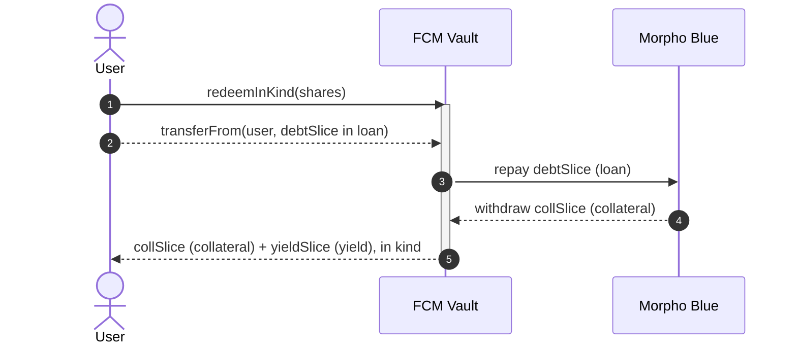
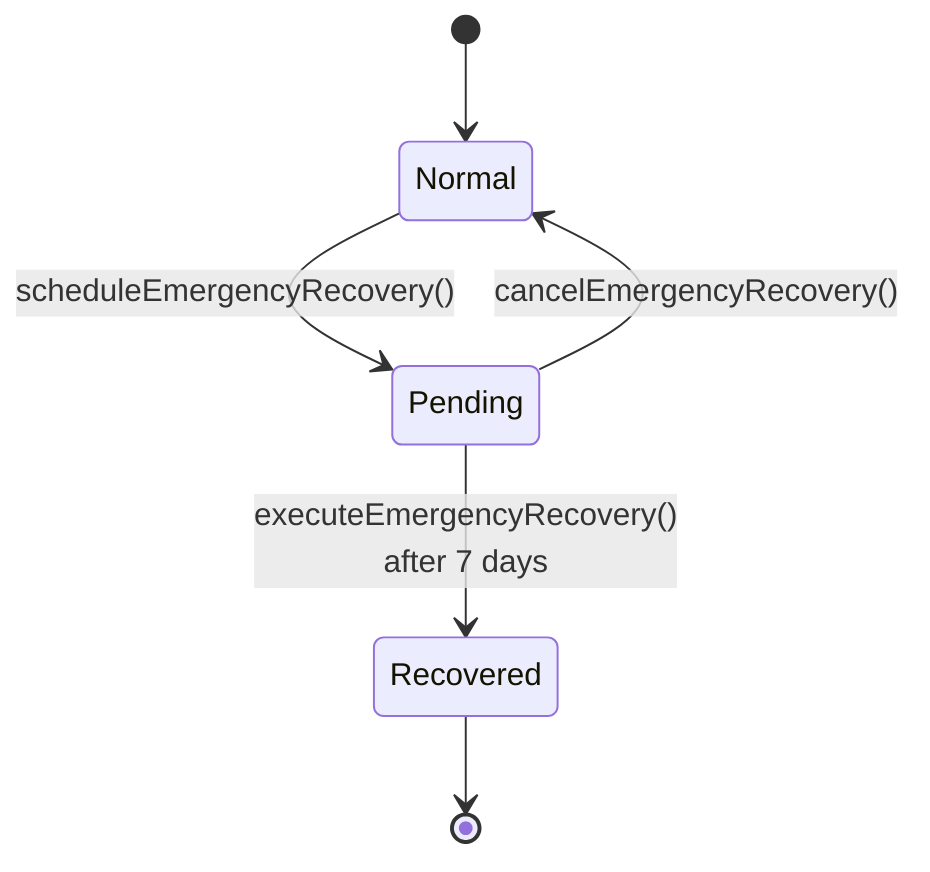

# FCM Architecture

How `FCMVault` implements the automated carry trade, and the tradeoffs behind each choice.
It assumes familiarity with [Morpho Blue](https://github.com/morpho-org/morpho-blue) (LTV, LLTV, market params) and Uniswap v3 (price limits, price impact).

This document covers **design and rationale**. Adversarial analysis lives in [`security.md`](./security.md), dependency-outage behaviour in [`security-surface.md`](./security-surface.md), inherent economic costs in [`risk-disclosures.md`](./risk-disclosures.md), and the owner/keeper runbook in [`operations.md`](./operations.md).

## Terminology

- **Collateral** — the token the user deposits and the vault posts to Morpho to create borrowing capacity. It is the vault's ERC-4626 asset.
- **Loan** — the debt token borrowed against the collateral. Also the unit every oracle price is quoted in.
- **Yield** — the yield-bearing token bought with the borrowed loan token. The carry source.
- **Yield/loan pool** — the AMM pool the vault trades the yield leg on (`YIELD_LOAN_POOL`).
- **Collateral/loan pool** — the AMM pool used only by `harvest` and by `redeem`'s reconciliation leg (`COLLATERAL_LOAN_POOL`).

## Position and accounting

The vault holds exactly three things, and `totalAssets()` values exactly those three:

```
totalAssets = collateralSuppliedToMorpho
            + yieldBalance   · yieldPrice / collateralPrice     (rounded down)
            − morphoDebt                 / collateralPrice      (rounded up)
```

saturating at zero. Everything is quoted in collateral-token units. Two consequences are load-bearing elsewhere:

- **Loan-token balances are not counted.** A loan-token balance sitting in the vault is invisible to NAV. Every flow is written to leave none behind — `harvest` reverts `LeftoverLoanTokens` rather than stranding any, and `redeem` reconciles its gap inside the repay callback. Excluding it is deliberate: NAV feeds share minting, fee accrual, and the performance high-water mark, so counting a raw balance would make all three donation-sensitive.
- **NAV is oracle-marked, not realizable.** Both legs are priced off oracles, and the yield leg's only exit is the AMM. See [`security.md` § Oracle manipulation](./security.md#oracle-manipulation).

Shares use OpenZeppelin's virtual-share convention with a fixed decimals offset of 6:

```
claims = totalSupply + 10**6
shares = contributed · claims / (navBefore + 1)          (rounded down)
```

`contributed` is the _realized_ NAV delta the deposit produced (`totalAssets()` after minus before), not the assets handed in. That is what makes entry self-funding: the depositor's own swap fee and price impact reduce their `contributed`, so they are credited with what they actually added rather than what they intended to add.

> Note: the vault does **not** inherit OpenZeppelin's `ERC4626`; it extends `ERC20` and implements the interface directly, reproducing the virtual-share mitigation via `_totalClaims()` and `_decimalsOffset()`. `decimals()` is overridden to match OZ's convention, `collateralDecimals + 6`, so the offset is absorbed by the reported scale and one whole share reads as roughly one whole asset at inception. The collateral token's decimals are read once at construction; a token without ERC-20 metadata reverts the deployment rather than mis-scaling shares.

## Design choices

### Deposit and redeem logic

There are two ways to structure entry and exit for a carry-trade vault:

|                              | Lazy (typical ERC-4626)                             | Atomic (chosen)                                           |
| ---------------------------- | --------------------------------------------------- | --------------------------------------------------------- |
| Capital allocation           | Deferred to the next `rebalance()`                  | Happens inside `deposit`/`redeem`                         |
| Entry/exit cost              | Socialized across all holders via later rebalances  | Borne entirely by the depositing/redeeming party          |
| ERC-4626 compliance          | Full — `preview`/`max` are trivial                  | Partial — `preview`/`max` depend on live Morpho/AMM state |
| Idle collateral buffer       | Needed to absorb deposits before the next rebalance | Not needed                                                |
| Async redemptions (ERC-7540) | Effectively required at high rebalance frequency    | Not needed                                                |

The lazy approach keeps every ERC-4626 function trivial, but defers the cost of levering/unlevering to the next rebalance — and since rebalancing runs at high frequency, that cost would be socialized across all holders unless additional safeguards were added.

The atomic approach was chosen instead: `deposit`/`redeem` enter and exit the position immediately, so the acting party covers their own cost and the position's LTV is never left worse off for existing holders. It also removes the need for an idle collateral buffer and for async redemption requests.

The tradeoff is that these actions now depend on live Morpho and AMM state, so several `preview`/`max` functions cannot be implemented meaningfully. Reduced ERC-4626 compliance was accepted in exchange for a smaller attack surface and no idle-liquidity requirement:

- `mint`, `withdraw`, `previewMint`, `previewWithdraw`, `previewDeposit`, and `previewRedeem` all revert `NotImplemented()`.
- `maxMint` and `maxWithdraw` both return `0`, consistent with `mint`/`withdraw` being unimplemented.
- `maxDeposit` and `maxRedeem` are implemented, but only as optimistic upper bounds — not guarantees. `maxDeposit` additionally returns `0` for a receiver without early access, and while a recovery is pending.
- `decimals()` returns `collateralDecimals + 6`, not the collateral's own decimals — the standard consequence of the virtual-share offset (see above).

#### Slippage protection

The ERC-4626 signatures `deposit(assets, receiver)` and `redeem(shares, receiver, owner)` take no slippage-limit argument, and both route a leg through an AMM swap with no vault-enforced minimum output. The vault therefore ships slippage-protected overloads, which are thin wrappers that call the base function and then check the result:

- `deposit(uint256 assets, address receiver, uint256 minSharesOut)`
- `redeem(uint256 shares, address receiver, address owner, uint256 minAssetsOut)`

Both revert `SlippageExceeded(output, minOutput)` on a shortfall. **Integrators should use these overloads, or a router that enforces an equivalent bound**, rather than the bare ERC-4626 signatures. Calling the bare signatures accepts whatever price the pool gives at execution time, bounded only by the pool's available liquidity.

Note the asymmetry with `rebalance`/`harvest`: those clamp the swap itself to an oracle-derived price bound, because they move _other people's_ funds. `deposit`/`redeem` move only the caller's own, so the check is a caller-supplied bound on the _outcome_. See [`security.md` § Permissionless rebalancing and sandwich risk](./security.md#permissionless-rebalancing-and-sandwich-risk).

### Trading the yield leg

Both levering and delevering need to convert between the loan token and the yield token. There are two ways to source that conversion: trade on an AMM, or go direct through the yield vault's own `deposit()`/`redeem()`. We chose the AMM.

A direct integration would need a bespoke implementation per yield source — each yield vault's deposit/redeem interface, decimals, and settlement semantics differ — and breaks down entirely for any yield source that settles asynchronously (ERC-7540-style request/claim vaults), since the atomic entry/exit design above has no room for a multi-step settlement. Trading on an AMM works against any tradeable token with a pool, with no vault-specific integration at all.

|                  | AMM                                                | Direct                                          |
| ---------------- | -------------------------------------------------- | ----------------------------------------------- |
| Liquidity source | AMM pool depth                                     | Yield vault's own deposit/redemption capacity   |
| Execution price  | Market price, not NAV (may realize above or below) | NAV, exact                                      |
| Cost             | Pays DEX fees/slippage                             | No LP fee, no slippage                          |
| Compatibility    | Any tradeable token, no vault-specific integration | Requires synchronous deposit/redemption support |

The loan and yield tokens form a stable/stable pair — the yield token is priced in, and appreciates slowly relative to, the loan token — so the pool can run at very high liquidity concentration, and needs far less depth than a volatile pair would to support the same position size.

How much depth is actually enough is a property of the specific deployment — the collateral's volatility, the band width, and the position size — not of the contract. Sizing it is the deployer's responsibility; see [`operations.md`](./operations.md).

### Liquidity source on exit

A redemption sells the yield slice for loan tokens on the yield/loan pool, then repays the pro-rata debt slice. Those proceeds rarely match the debt slice exactly — a thin pool, an adverse tick, a depegged yield token — leaving a gap (surplus or shortfall) that must be reconciled before collateral can be released.

The vault closes this gap inside **Morpho's repay callback**. `MORPHO.repay` is called by shares with a non-empty `data` payload. Morpho burns the debt shares first (the accounting repayment), then invokes `onMorphoRepay` _before_ pulling the loan tokens from the caller. That ordering is the whole point: by the time the callback runs the debt is already repaid, so the collateral withdrawal inside it is health-neutral — Morpho's health check sees the freed collateral against already-reduced debt, not an over-levered position near LLTV.

Inside `onMorphoRepay`, the vault withdraws the collateral slice and reconciles the gap on the collateral/loan pool:

- **Shortfall** (yield sale proceeds < debt slice): sell collateral → loan (`exactOut`) to raise the remaining loan tokens.
- **Surplus** (yield sale proceeds > debt slice): sell the excess loan → collateral (`exactIn`).

After the callback returns, Morpho pulls the full debt slice in loan tokens from the vault. The vault now holds the collateral slice (plus or minus the swap difference) entirely in the collateral token, which `redeem` transfers to the receiver.

This uses no flash loan and draws the Morpho singleton only once per redemption, so there is no structural cap on the size of a single `redeem`; the binding constraint is pool depth, not singleton balance.

#### The health gate on `redeem`

If the vault's LTV exceeds `LTV_MAX` **and** it holds a nonzero yield balance, `redeem` reverts `VaultUnhealthy()`. Note that `LTV_MAX` is the top of the rebalance band, well below `MARKET_LLTV` — so this gate trips while the position is still solvent, not only when it is actually near liquidation.

That is deliberate, and it is not primarily a safety guard: it prevents a race for pool liquidity under stress. When LTV is above the band, the yield slice is worth less than the debt slice, so every redeemer would need to sell collateral on the collateral/loan pool to close the gap. Blocking `redeem` until a `rebalance` restores the band means redeemers never compete with the rebalancer for that pool's liquidity at the worst possible moment. Anyone can call `rebalance()` to clear the gate, and `redeemInKind` is never gated on it.

The `_yield() != 0` conjunct is what lets a fully unwound position (no yield leg left to sell) still be redeemed even if its LTV reads high.

### Escape hatch: `redeemInKind`

A swap-free, in-kind exit, exposed as its own function distinct from the standard `redeem`. The caller repays the owner's pro-rata debt slice in loan tokens, the owner's shares are burned, and the receiver gets the pro-rata collateral and yield tokens in kind.



Because it delivers the yield leg in kind instead of selling it, it needs no swap — so it does not depend on the AMM or the yield vault to liquidate that leg (the two routes a normal `redeem` uses), and stays available when AMM liquidity is thin or manipulated.

Its remaining dependencies:

- It still settles through Morpho, so the collateral withdrawal is subject to Morpho's health check. Because the debt slice and collateral slice are both pro-rata, the operation preserves the position's LTV rather than improving it — so Morpho still rejects it on an underwater position. It is swap-free, but not an exit of last resort.
- Fee accrual runs on entry and marks NAV via both oracles, so it is swap-free but **not oracle-free**.
- The caller must hold and approve the loan-token debt slice; it is not sourced from the position. The yield leg comes back as yield tokens, to be unwound separately.

### Rebalancing

The position drifts on its own: the collateral price moves, Morpho accrues interest on the debt, and the yield token appreciates. Rebalancing pulls the vault back toward its intended leverage without anyone taking custody of the position.

It is split across two entry points — `rebalance()` adjusts leverage, `harvest(maximumYield)` realizes surplus yield into collateral — deliberately kept separate so a keeper can size the yield sale independently of the leverage decision. Both are permissionless; see [`security.md`](./security.md#permissionless-rebalancing-and-sandwich-risk) for why, and what bounds it.

#### The LTV band

Two immutable constants define the operating band, ordered by the constructor as `ltvMin < ltvMax < marketLltv`:

| Constant  | Role                                                 |
| :-------- | :--------------------------------------------------- |
| `LTV_MAX` | Upper bound — above it the position is over-levered  |
| `LTV_MIN` | Lower bound — below it the position is under-levered |

`rebalance()` reads the current debt and collateral once and takes one of three paths:

- **Inside the band** — no-op. The band exists so ordinary price noise does not pay AMM fees. The comparisons are strict (`debt > maxDebt` / `debt < minDebt`), so landing exactly on either edge is a no-op.
- **Above `LTV_MAX`** — delever: sell yield for loan on the yield/loan pool and repay debt, bringing LTV down to `LTV_MAX`.
- **Below `LTV_MIN`** — lever up: borrow loan, swap it for yield on the yield/loan pool, and repay whatever the swap did not consume, bringing LTV up to `LTV_MIN`.

Both branches rebalance to the edge that was breached, not to a central target. Swap cost is price impact plus the pool's LP fee, and both scale with volume, so the smallest swap that restores the position to the band is the cheapest way to do it. Landing at a midpoint would trade more than necessary on every excursion.

`deposit` is the exception: fresh collateral is levered toward the **midpoint** of the band, `(LTV_MIN + LTV_MAX) / 2`. A deposit is not responding to a breach, so it should leave symmetric headroom in both directions rather than parking the position next to a bound it would immediately trip. The borrow is capped both by what the fresh collateral supports on its own and by the whole position's headroom to that target, so a deposit never levers up the _existing_ position beyond the midpoint.

Lever-up is additionally suppressed while an emergency recovery is pending: the position is slated for wind-down, so adding debt and paying AMM cost works against it. Delever stays live — it only de-risks. Cancelling the recovery restores lever-up immediately.

#### Why the rebalance swap is stable/stable

The collateral is never sold to rebalance. Only the debt leg moves:

```
delever:  sell yield → loan, repay      x = D − LTV_MAX · V
lever-up: borrow loan → buy yield       x = LTV_MIN · V − D
```

Because the collateral is untouched, `V` — the denominator of `LTV = D / V` — does not move during a rebalance. Two consequences follow, and together they are the main reason the strategy is cheap to run:

- **The swap is stable/stable.** Both sides of the rebalance trade are the loan asset and a yield token denominated in it, so the swap sits in a low-fee, low-volatility pool rather than crossing the volatile collateral pair. Only `harvest` ever touches the collateral/loan pool, and only to _buy_ collateral.
- **The swap is small.** Rebalancing corrects the numerator only, so each trade is the LTV gap times collateral value — not a fraction of the whole position. How small in practice, and how often it fires, depends entirely on the collateral's volatility and the width of the configured band; neither is a property of the contract.

A design that sold collateral to delever would move `V` and `D` at once, cross the volatile pair on every rebalance, and pay both the higher fee tier and materially higher price impact — while also reducing the depositor's collateral exposure, which is the thing they came for.

### Harvest

`harvest` is the compounding leg. It measures how much yield the vault holds above what is needed to back the debt:

```
yieldToHarvest = min(maximumYield, yield − debt · 1e36 / yieldPrice)     saturating at 0
```

where `debt · 1e36 / yieldPrice` (rounded down) is the yield-token balance whose oracle value backs the debt. Any surplus is value the vault has earned but not yet captured, so harvest realizes it in two legs: yield → loan on the yield/loan pool, then loan → collateral on the collateral/loan pool, supplying the result as fresh collateral to Morpho.

Harvest is add-only — it never borrows and never withdraws — so it cannot push the position toward liquidation. It raises the LTV's denominator; if that drops LTV below `LTV_MIN`, the next `rebalance()` borrows against the new collateral to restore leverage.

**Why it is a separate entry point.** Splitting harvest out of rebalance buys two things:

- **Failure isolation.** Harvest is the only path that touches the collateral/loan pool, the thinner and more expensive of the two. Inside `rebalance()`, a revert on that leg — an exhausted pool, a `LeftoverLoanTokens` condition — would unwind the delever that had already executed in the same transaction, discarding safety-critical work because a compounding step failed. Delevering must not depend on the harvest pool being healthy.
- **Independent sizing.** `maximumYield` lets the caller spread a large surplus over several calls rather than crossing both pools in one block. That knob only makes sense on a function a keeper can call on its own schedule; forcing it through `rebalance()` would couple the yield-sale size to the leverage cadence, which is set by price volatility and has nothing to do with how much surplus has accrued.

The two legs handle a partial fill differently. Leg 1's unsold surplus simply stays as yield tokens and is retried next harvest. Leg 2 is stricter: if the collateral/loan pool cannot convert all the loan tokens, the call reverts `LeftoverLoanTokens` rather than stranding loan tokens that NAV cannot see. The caller retries with a smaller `maximumYield` that fits the pool's depth.

### Partial fills instead of reverts

Every swap in `rebalance` and `harvest` carries a `sqrtPriceLimitX96` derived from the relevant oracle discounted by `maxSlippageBps`. The pool fills only while its marginal price stays inside that bound, then stops. Consequences:

- A rebalance too large to reach the band edge within tolerance **partial-fills** and lands part-way. It does not revert.
- A pool already priced past the bound makes the leg a **no-op**, not a revert: `SwapLib.swapLimit` compares the derived limit against `slot0` and returns a "skip" flag, so the pool is never called.
- The bound is on the pool's marginal price relative to the oracle — i.e. on price impact. The LP fee is a separate, known cost taken on the input and is not part of it.

Choosing partial fill over revert trades a hard failure for a soft, temporary drag that resolves over subsequent calls. The cost is delayed compounding: a partial delever leaves LTV closer to the liquidation threshold for longer than a full one would.

Note the interaction with the default configuration: `maxSlippageBps` initializes to `0`, which makes the bound exactly the oracle price and therefore skips any swap the pool cannot fill at or better than fair value. A freshly deployed vault does not rebalance meaningfully until the owner sets it — see [`operations.md`](./operations.md).

### Fees

Two fees, both paid by **minting shares to `feeRecipient`**. No assets ever leave the vault; the charge is dilution of existing holders.

| Fee         | Base                                                    | Cap                |
| ----------- | ------------------------------------------------------- | ------------------ |
| Management  | NAV × rate × elapsed time                               | 1000 bps (10 %/yr) |
| Performance | Price-per-share gain above the all-time high-water mark | 5000 bps (50 %)    |

`_accrueFees()` runs at the top of `deposit`, `redeem`, `redeemInKind`, `rebalance`, `harvest`, and the three fee setters, and is additionally exposed as a permissionless `accrueFees()` so a keeper can tick the management fee during idle stretches. It always calls `MORPHO.accrueInterest` first so NAV is marked against fresh debt. The remaining owner functions — `setMaxSlippageBps`, `setMaxTvl`, the allowlist setters, and all three emergency-recovery functions — do not accrue, which is what keeps them available when an oracle is down.

Design points worth calling out:

- **The elapsed window is capped at one year.** Idle time beyond that is forgiven, which bounds a single catch-up dilution after long dormancy and makes the realized drag provably at most the nominal annual rate.
- **The high-water mark only ratchets up**, so a performance fee cannot be charged twice on the same gain. It is seeded at the starting price-per-share so the first deposit is not counted as performance. Because the mark is unrealized, a fee crystallized at a peak is not refunded if performance later reverses — see [`risk-disclosures.md` §2](./risk-disclosures.md).
- **Accrual never reverts.** If `feeRecipient` is unset, is not allowlisted, or NAV is zero, the mint is skipped silently rather than bricking `deposit`/`redeem`/`rebalance`. The clock and high-water mark still advance, so a skipped period is forgiven rather than back-charged later.
- **Fee shares go to `feeRecipient`, never to `msg.sender`.** A permissionless `accrueFees()` therefore pays its caller nothing.

### Access control and lifecycle

#### Early access allowlist

`_update` — the ERC-20 hook on every mint, transfer, and burn — enforces an allowlist:

| Movement                 | Requirement                  |
| ------------------------ | ---------------------------- |
| Mint (`from == 0`)       | receiver allowlisted         |
| Transfer (both non-zero) | **both** parties allowlisted |
| Burn (`to == 0`)         | always allowed               |

Burns are unconditionally permitted, which is what preserves the exit path: a holder who is later de-allowlisted can still `redeem` and `redeemInKind`, they just cannot transfer. Note that `deposit` itself has no caller gate — the constraint lands on the _receiver_, so anyone can fund a deposit for an allowlisted account.

#### Ownership

`Ownable2Step`: transfers require the new owner to `acceptOwnership()`. There is no time delay between the two steps, and no timelock on any owner setter — see [`risk-disclosures.md` §10](./risk-disclosures.md) and [`security.md` § Owner trust](./security.md#owner-trust).

#### Emergency recovery

A one-way, timelocked wind-down. Three states:



**Pending** (`emergencyRecoveryActive`), immediately on scheduling:

- `deposit` and `harvest` revert `EmergencyRecoveryActive`; `maxDeposit` returns 0.
- `rebalance`'s lever-up branch is suppressed. Delever still runs.
- `redeem` and `redeemInKind` stay open for the full 7-day window.
- The owner can cancel at any point before execution, restoring all of the above.

**Recovered** (`emergencyRecovered`), after execution — this is **terminal and irreversible**:

- All collateral is withdrawn from Morpho and the vault's entire collateral, yield, and loan-token balances are transferred to `owner()`.
- `cancelEmergencyRecovery` reverts, so the flag can never be cleared.
- `rebalance`, `redeem`, and `redeemInKind` all carry the `notRecovered` guard and therefore **revert permanently**. `maxRedeem` returns 0.
- Shares remain outstanding but have no on-chain claim on anything. Any distribution to holders happens off-chain, at the owner's discretion.

Execution also requires the debt to have been repaid **from outside the vault** first: the contract itself never repays here, and Morpho refuses to release the collateral while borrow shares are outstanding. The external repayment and the `executeEmergencyRecovery` call should be bundled atomically — see [`operations.md`](./operations.md#emergency-recovery). This is by far the largest trust assumption in the system; it is analysed in [`security.md` § Owner trust](./security.md#owner-trust).

### Observability

`rebalance`, `harvest`, `deposit`, `redeem`, and `redeemInKind` are each wrapped in `logsVaultState`, which emits a `VaultState(collateral, debt, yield, collateralPrice, yieldPrice)` snapshot _after_ the body runs. Because the modifier runs unconditionally, even a no-op `rebalance` or a zero-amount `deposit` emits a snapshot — which is also why those calls still touch Morpho and both oracles ([`security-surface.md`](./security-surface.md)).

## Dust strategy

The vault keeps no running ledger of who is owed what; `totalAssets()` and every pro-rata slice are computed live off actual balances and Morpho's own position accounting. That means dust — amounts too small to matter individually — is never "lost", only re-absorbed into the position for whoever holds shares next, rather than swept anywhere or credited to a specific caller:

- **All pro-rata math rounds in the vault's favor** (deposit shares down, redeem/`redeemInKind` slices down, fee shares up — see [`risk-disclosures.md` §6](./risk-disclosures.md)). The remainder stays in the position and inflates `totalAssets()` for remaining holders by a dust amount on every call.
- **A dust harvest surplus is a no-op, not a zero-amount swap.** If `yieldToHarvest` rounds to zero, `harvest` returns early rather than passing a zero amount into the pool, which would revert. The surplus is not lost — it stays as yield-token balance and is picked up by a later harvest once it has grown.
- **`_unwindSlice` reads the swap's realized output, not the vault's loan-token balance.** So any loan-token dust already sitting in the contract is excluded from that redemption's accounting; it remains vault balance rather than being handed to whichever redeemer called first. The same pattern applies to `redeem`'s collateral payout, which is measured as a balance delta.
- There is no dedicated dust-sweeping function and no minimum-swap-size floor beyond the harvest no-op. Dust is small enough by construction — bounded by rounding and by `maxSlippageBps`-limited partial fills — that a sweep would cost more gas than it recovers. Emergency recovery is the only path that moves it.
